# 👋 Hi everyone

I'm a Data Migration Specialist with 15+ years of IT experience spanning bare-metal infrastructure, virtualization, and frontend development. Currently focused on ETL pipelines, Python scripting, SQL data transformation, and REST API automation — migrating law firms from legacy practice-management systems into modern SaaS platforms.

---

## 👨‍💻 Tech Stack

Here’s a quick overview of technologies I’ve worked with, including what I use daily, what I’ve used professionally, and tech I’ve explored out of curiosity or just for fun.

### 🐍 Data & Automation

### ☁️ Infrastructure & Cloud

<!-- 

 -->

### 🎨 Frontend

### 🐧 OS & Tools

### 🔍 Things I’ve tinkered with (I’m curious)

---

## 🧰 Background Snapshot

- Data Migration Specialist — ETL pipelines, Python scripting, SQL data transformation, REST API automation, and browser automation with Playwright for migrating law firms into SaaS platforms
- 15+ years in IT working with on-prem, bare-metal, and virtualized environments
- Experience with Linux systems, VMware, servers, L2 networking, and storage (both hands-on and in solution design)
- Spent a year working professionally as a Frontend Developer with React, Redux, and Vitest 🤷‍♂️🤹‍♂️

---

## 📫 Let’s Connect

## 📊 GitHub Stats

---

_Thanks for stopping by!_
